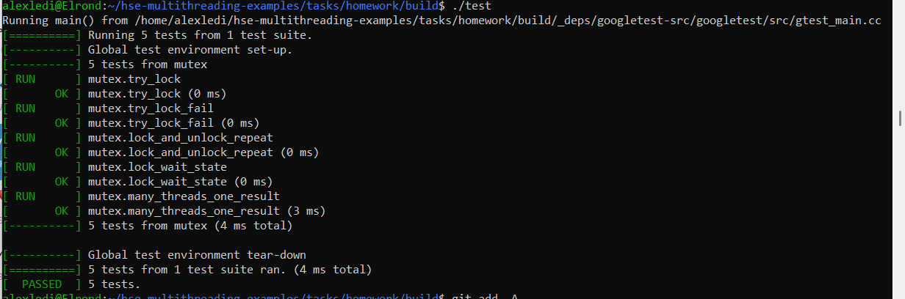

В общем, я исходила из того, что это неориентированный граф, который задается кучей пар вершин, между которыми ребра, и числом вершин, которые нумеруются с нуля и до числа вершин в графе - 1.

На ассертах падений нет, видно, что за счет кооперативной многозадачности два обхода по графу по очереди находят следующие вершины:

